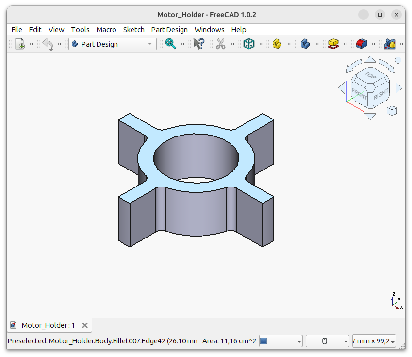
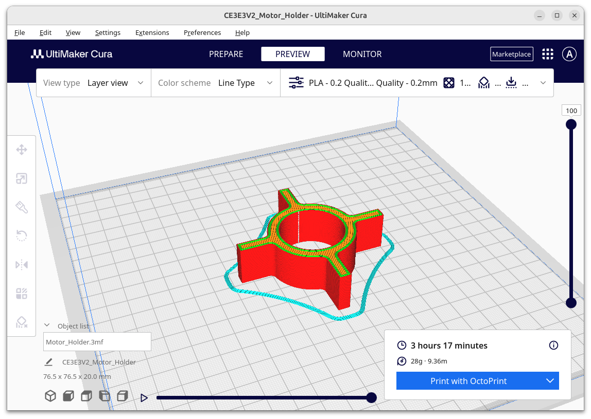

# ROV Underwater Drone
A DIY (Do It Yourself) ROV (Remotely Operated Vehicle), also known as an aquatic drone, is an underwater robot controlled remotely by an operator on land. 

Share it with others and build it for free at home with your kids. It is an excellent hands-on way to learn engineering and teamwork, using simple materials and a curious mindset.

## Electronic Circuit

### Breadboad

### Schematic

## Arduino Code

## 3D Printed Parts

### Motor Holder

